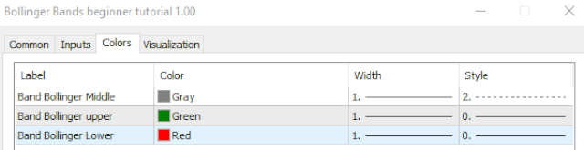
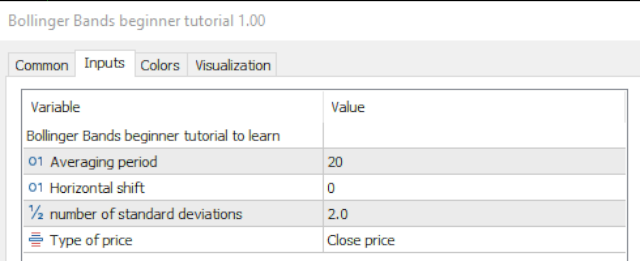
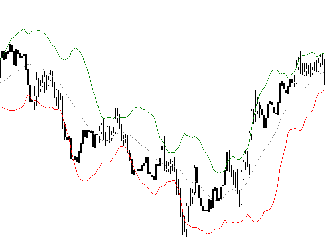

# 🚀 Unlock the Power of Trading!

Welcome to this open-source trading project. Here you will find powerful tools to enhance your trading journey. If you find this project useful, please consider starring ⭐, sharing, or donating to support further development!

---

**Support the project:**
- Star this repository on GitHub
- Share it with your trading friends
- [Donate here](https://www.paypal.com/donate/?hosted_button_id=YOUR_BUTTON_ID) to help us grow!

---

## Files included:
### Source Files:
- `bollinger_bands_beginner_tutorial_by_william210.mq5`

### Screenshots:

> Made with ❤️ for the trading community.
